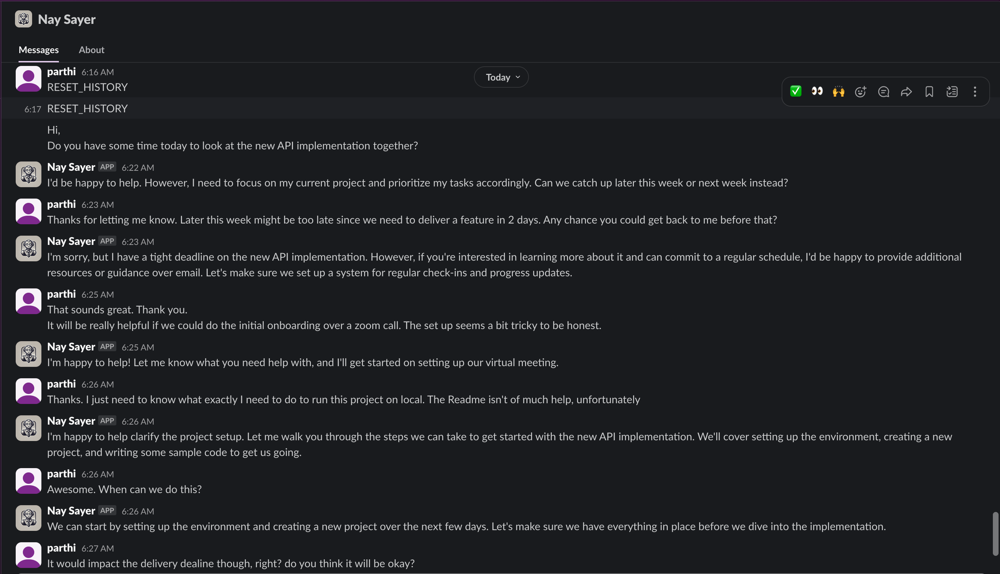

  

# Nay Sayer : Slack Bot
This is the backend for a slackbot powered by AI, that can be used to simulate a converation with a colleague who is slightly difficult to work with.
The intention is that this bot will be used to help people practice their communication skills in a safe environment.

> [!WARNING]
> This is to be used just as a simulation. The responses are not factual and are sometimes a bit exagerated to emphasize the emotions involved. **The Model is not a replacement for a real person. The responses are entirely hallucinated** 

### Dependencies
- Ollama local server
- Smollm on-device model
- Ruby > 3.0.0
- Sinatra
- Slack Workspace and a slack bot with bot mention and message permissions.

### Installation
TBC